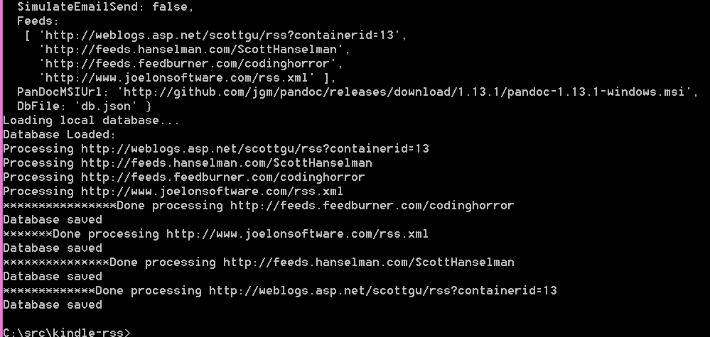

kindle-rss
==========

A script for sending new RSS items to my Kindle

### Installation

* Rename `config.jsonSAMPLE` to `config.json`
* Edit the values in `config.json` with your own information
	* kindleEmail: The email address [assigned to your kindle](https://www.amazon.com/mn/dcw/myx.html#/home/settings/payment).
	* Feeds: An array of RSS feed URLs to monitor

#### Be sure to whitelist the sender email address in your [Amazon account](https://www.amazon.com/mn/dcw/myx.html#/home/settings/payment)